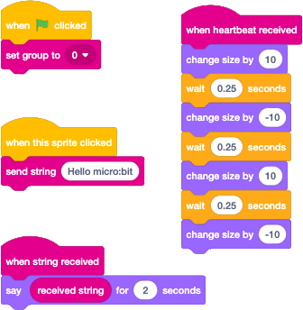

# Scratch Radio
## Initial Idea
To bring the micro:bit's radio commands to Scratch to allow the two enviroments to communicate with each other.

## Hardware Design
The most straightforward, widely accessible and least problomatic option was to use a micro:bit connected to the computer running scratch via a USB cable, acting as a gateway between the two environments.

## Extension Design
Wanting to make the use of this as easy as possible I decided to use the browser WebUSB API to handle communications with the micro:bit. While this functionality currently isn't supported by all browser I thought that it being available in Chrome and Edge was enough. Hopefully this situation will improve over time, to see the current level of support within all browserto visit [Can I Use, WebUSB](https://caniuse.com/webusb). Due to the browser handling everything the is no need for anything to be locally installed (very important when hardware is locked down and install rights limited).

The extension itself if made up of 3 layers, a base layer to handle communicating with the micro:bit, a middle layer that handles the sending and receiving of commands and the top layer that interfaces with Scratch.

The base layer is primarily built on a modified version of the [microbit-webusb library by Bill Siever](https://github.com/bsiever/microbit-webusb). I did start off coding this area myself but while investigating what I needed to do I came across this most useful library. At this point I decided not to re-invent any wheels and just tweaked the wheel slightly to better suit my requirements.

The middle layer deals with the formatting of commands to send and the decoding of commands received. As communications with the micro:bit are over a serial connection this just meant the sending and receiving of strings. The strings are field delimited using an ASCII character 30 hopefully meaning that it won't be included in a string and cause chaos. Commands sent are done so immediately but due to the way that Scratch deals with raising events received commands are placed in a queue for processing by Scratch.

The top layer is mainly taken up by the extensions block definition and then interfacing with the middle layer. As mentioned above commands sent are sent immediately but, when polled, the events check to see if there is anything queued and if so pulls the oldest off the queue, populates the received fields and raises the event. There is an additional heartbeat event that is raised by the gateway to show it is still there and working.

## Design
The gateways design is simple converting received radio commands into serial commands and visa versa. This allows the micro:bit's radio to act like it is directly connected to Scratch. On top of the standard radio commands / events there are a couple of additional functions. The first receives a request the check if the gateways is there and then responses appropriately while the second is a heartbeat message that is sent every five seconds to confirm it's still there and alive. I wrote this too in blocks to allow people to easier understand what is happening. The .hex file of this is linked to below.

## Developing The Extension
Unfrotunately I knew that I would not be able to include my extensions into the main Scratch site so I started looking into where and how was currently best. A big timesaver that I ended up using is the [scratch-extension-development GitHub template by Dale Lane](https://github.com/dalelane/scratch-extension-development) for creating Scratch extensions. He's taken all the legwork out of setting up an environment for development and where to host the final result. You code and test your extensions in GitHub codespaces before finally hosting it in GitHub pages. To make the process as easy as possible he provided scripts to automate all the setup / build / deploy tasks too.

## Running The Gateway
Make sure you have downloaded and then copyed the [microbit-RadioGateway.hex](https://github.com/RBilsland/ScratchRadio/blob/main/hex/microbit-RadioGateway.hex?raw=True) file to a microbit. Next make sure the micro:bit is connected to the computer using a USB cable. If you have just programmed it from MakeCode then unplug and then re-plug it back in to make sure it's ready for a new connection.

Next visit my version of scratch [https://rbilsland.github.io/ScratchRadio/scratch/](https://rbilsland.github.io/ScratchRadio/scratch/) using either Chrome or Edge and choose to add extension and chose my new extension. You'll be prompted to that you should select your gateway micro:bit, ok this and select your micro:bit. From this point you should be good to go.

## Running My Demo
To run my demo download and then copy the [microbit-RadioDemo.hex](https://github.com/RBilsland/ScratchRadio/blob/main/hex/microbit-RadioDemo.hex?raw=True) file to another micro:bit. In Scratch create the following blocks.

If everything is working then clicking on Felix should sent the message "Hello micro:bit" to the micro:bit and clicking button A on the micro:bit should send the message "Hello Felix" to Scratch.

If you do have issues with getting communications running between Scratch and a micro:bit then just like coding the micro:bit's make sure you are using the same group number on each side. If you are then currently my next suggestion is to refresh the browser and unplug and plug back in again the micro:bit and try again.

## Known Issues
Currently I'm aware that loading an .sb3 file back into my version of Scratch that references the radio extension doesn't work, so I'll be looking into that next as it somewhat stop's any long term development. I'l also aware that the whole connecting with the gateway micro:bit could be better so that's on my radar too.

## Uses
As the radio communication between Scratch and the micro:but gateway is two way there are many things. Maybe many micro:bits radioing into Scratch showing who put their hand up to answer a question first, maybe controlling a micro:bit controlled robot from a Scratch interface, or maybe allowing communication between multiple Scratch sessions allowing multiplayer gaming.